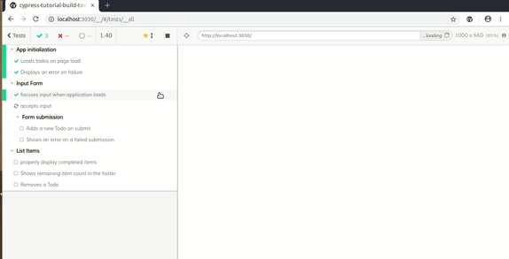
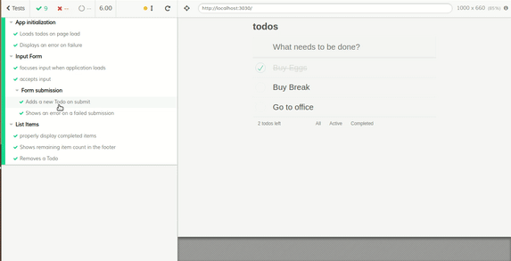

# End to end Testing React App with Cypress

## About

**[Cypress](https://vimeo.com/237527670)** is a modern end to end testing tool which is written in Javascript that helps developer to write complete automated testing suites that tests the app with various flows like a real Tester!

Once you run your test flows, you can also go back in time and see how DOM was looking at each step!!

 

## Working with Cypress

### Setup and running
- run `npm i` to install all dependencies
- run `npm run dev` to run the react app locally
- finally run `npm run cypress` to launch cypress

On the cypress home screen, click  `Run all tests` or click on any spec file to only
run one spec

### Mocking APIs via `cy.server()`
Mocking external API calls is super easy using `cy.server()` and `cy.route({...})` methods. Checkout the usage in `app-init.spec.js`

You can also mock a data that you expect to return and store it in `fixtures` folder.

### Create custom commands
You can create your own command that does simple tasks such as mocking some APIs, seeding some data, etc and then use this command in your tests like a normal method.

Checkout `seedAndVisit` command created in `cypress/support/commands.js` and its usage.